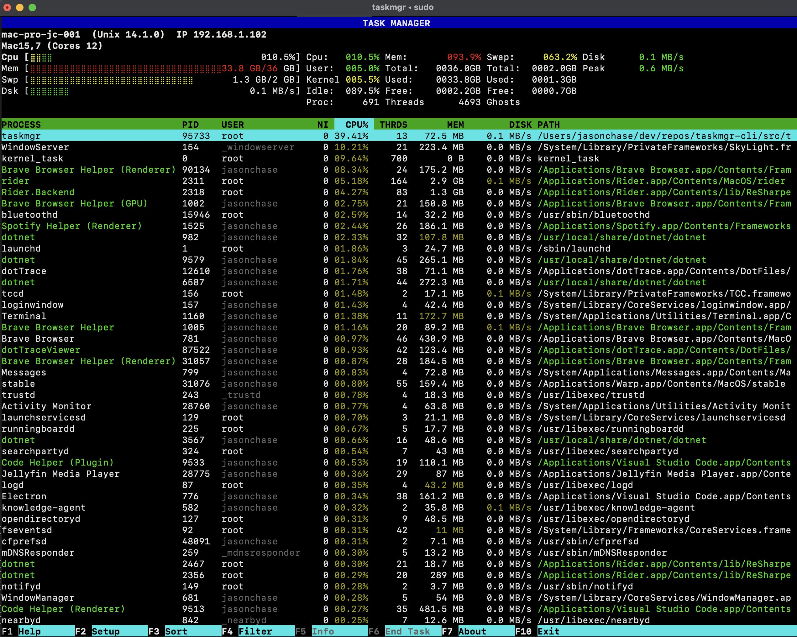
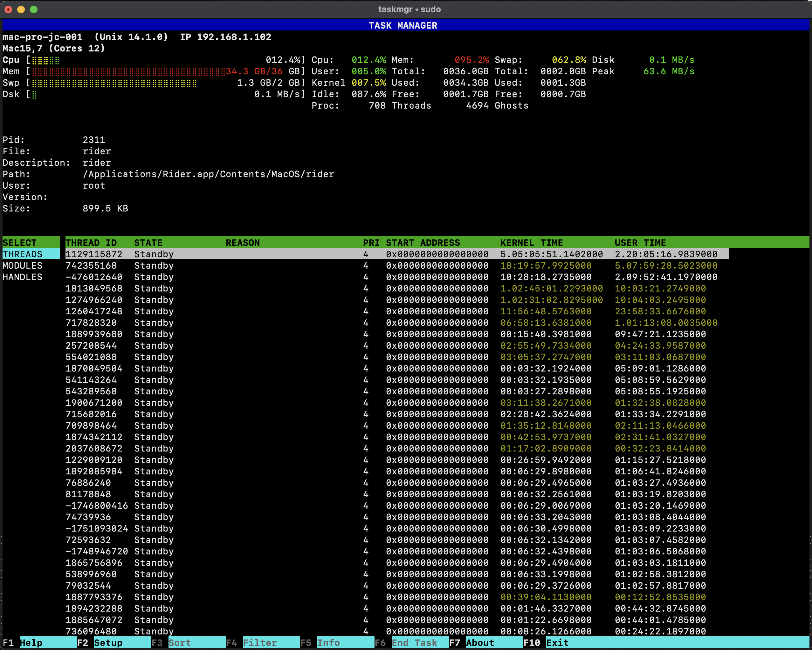

# taskmgr-cli
A powerful, cross-platform command-line task manager with real-time process monitoring, advanced filtering, and rich system information display. Built with .NET Native for Windows and macOS.

## Process List


## Threads


## Features

### Core Capabilities

- **Real-Time Process Monitoring** - Live updates of CPU, memory, disk I/O, and thread counts
- **Advanced Process Information** - View detailed module lists, thread states, and command-line arguments
- **Multi-Process Selection** - Select and terminate multiple processes simultaneously
- **Smart Filtering** - Filter by process name, username, or PID
- **Flexible Sorting** - Sort by any column (CPU, memory, disk, threads, priority)
- **Rich System Metrics** - Visual meters for CPU cores, memory usage, and system statistics
- **Keyboard-Driven Interface** - Full F1-F10 hotkey support for efficient navigation

### Customization

- **5 Built-in Themes** - Colour, Mono, MS-DOS, Tokyo Night, and Matrix
- **Configurable UI** - 26 customizable color keys per theme
- **Adjustable Performance** - Configurable update intervals and process display limits
- **IRIX Mode** - Toggle between per-core and total CPU reporting

### What Makes taskmgr Unique

**Deep Process Insights**
- **Thread-Level Information**: View individual thread states, CPU times, and priorities to verify process termination beyond just PID checks
- **Windows Service Details**: Shows actual service names and startup parameters, not just generic `svchost.exe` entries
- **Module Analysis**: Full DLL/library enumeration for each process
- **Command-Line Visibility**: See exact startup parameters for running processes

**Cross-Platform Native Performance**
- Platform-specific optimizations using native APIs (Win32, Mach kernel)
- No generic cross-platform wrappers - direct system calls for maximum performance
- Optimized for both Intel and Apple Silicon architectures

#### Build from Source

**Prerequisites:**
- .NET 9.0 SDK or later
- macOS 11+ or Windows 10+

**macOS:**
```bash
git clone https://github.com/yourusername/taskmgr-cli.git
cd taskmgr-cli
./build.sh
```

**Windows:**
```powershell
git clone https://github.com/yourusername/taskmgr-cli.git
cd taskmgr-cli
.\build.ps1
```

**Run Tests:**
```bash
./test.sh           # macOS/Linux
.\test.ps1          # Windows
```

**Publish Portable Executable:**
```bash
./publish.sh        # macOS/Linux
.\publish.ps1       # Windows
```
Published binaries are located in `src/taskmgr/bin/Release/net9.0/{RID}/publish/`.

### Usage

**Basic Usage:**
```bash
taskmgr
```

**Command-Line Options:**
```bash
taskmgr --filter-pid 1234              # Monitor specific process
taskmgr --filter-user username         # Filter by user
taskmgr --filter-process chrome        # Filter by process name
taskmgr --sort-col cpu --sort-desc     # Sort by CPU usage
taskmgr --delay 2000                   # Update every 2 seconds
taskmgr --nprocs 25                    # Show top 25 processes
taskmgr --iterations 10                # Run for 10 iterations then exit
```

**Keyboard Shortcuts:**
- `F1` - Help screen
- `F2` - Setup/configuration
- `F3` - Filter processes
- `F4` - Sort options
- `F5` - Process details (modules, threads, handles)
- `F6` - Multi-select mode
- `F8` - Kill selected process(es)
- `F9` - Process column display
- `F10` - Exit
- `↑/↓` - Navigate process list
- `Space` - Select/deselect process (multi-select mode)

## Configuration

Configuration is stored in `taskmgr.ini` in the application directory.

## Platform-Specific Notes

### macOS

- **Apple Silicon Optimization**: Release builds require `[MethodImpl(MethodImplOptions.NoOptimization)]` on hot-path methods to prevent JIT optimizer from eliminating cancellation checks
- **IRIX Mode Default**: CPU percentages can exceed 100% (per-core reporting)
- **Permissions**: May require elevated privileges for full process access

### Windows

- **Service Details**: Shows full service name and startup parameters for `svchost.exe` processes
- **Non-IRIX Mode Default**: CPU percentages range from 0-100% (total system)
- **Administrator Mode**: Run as Administrator for access to all processes

## Contributing

Contributions are welcome! Please follow these guidelines:

1. **Fork the repository** and create a feature branch
2. **Write tests** for new functionality
3. **Follow C# coding conventions** - see existing codebase for style
4. **Update documentation** for user-facing changes
5. **Submit a pull request** with a clear description

### Permission Denied Errors

**macOS/Linux**: Run with `sudo` for full system access:
```bash
sudo ./taskmgr
```

**Windows**: Run as Administrator (right-click → "Run as administrator")

### Terminal Display Issues

Ensure your terminal supports:
- ANSI escape sequences
- UTF-8 encoding

Recommended terminals:
- **macOS**: Terminal.app, iTerm2, Warp
- **Windows**: cmd.exe, Windows Terminal, Powershell, Warp
